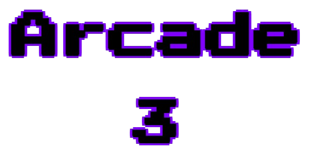

        <a href="https://github.com/FutureElliotto/arcade-3" target="_blank">
        

## Credits
- [a456pur](https://github.com/a456pur)
- [anonygoose](https://penguinmod.com/profile?user=anonygoose)
- [cloter](https://scratch.mit.edu/users/cloter/)
- [DomPizzie](https://github.com/DomPizzie)
- [guiles](https://scratch.mit.edu/users/guiles/)
- [mvbit](https://penguinmod.com/profile?user=mvbit)
- [Pacmanfan1112](https://scratch.mit.edu/users/Pacmanfan1112)
- [quadrupleslap](https://scratch.mit.edu/users/quadrupleslap)
- [RokCoder](https://scratch.mit.edu/users/RokCoder)
- [YousefIbrahimismail](https://github.com/YousefIbrahimismail)
## Change Log
- 2/08/2025/9:22/PM added Soccer Bros and Paper.io
- 2/08/2025/2:57/PM added Yohoho.io
- 2/06/2025/7:68/PM added Tetris, Iron Snout, Wrestle Bros, and Snow Rider 3D
- 2/01/2025/10:46/PM added Run 1, Run 2, Run 3, and idle breakout
- 1/31/2025/11:02/PM added HTML Editor and Polytrack
- 1/26/2025/9:00/PM added Frogger and Stickman Hook
- 1/26/2025/3:21/PM added A Plumber For All Seasons
- 1/25/2025/3:21/PM added Bitlife and 1v1.lol
- 1/24/2025/8:05/PM added Fruit Ninja, Super Mario All Stars, And Basketball Stars
- 1/20/2025/4:55/PM added Wonderputt, Super Mario World, and Astroids
- 1/14/2025/1:08/PM added Apps, Youtube, Wikipedia, Ruffle, and Centipede
- 1/6/2025/3:26/PM added Minecraft, Five Nights At Freddys 4, Five Nights At Freddys 3, Five Nights At Freddys 2, Five Nights At Freddys 1, and Doodle Jump
- 1/5/2025/2:16/PM Added a hover effect to the game buttons
- 1/4/2025/11:36/PM Added Super Mario 63 and Plants vs Zombies
- 1/2/2025/10:00/PM Added Drift Boss
- 1/1/2025/4:25/PM Improved readme
- 1/1/2025/3:46/PM Added change log and tunnel rush

